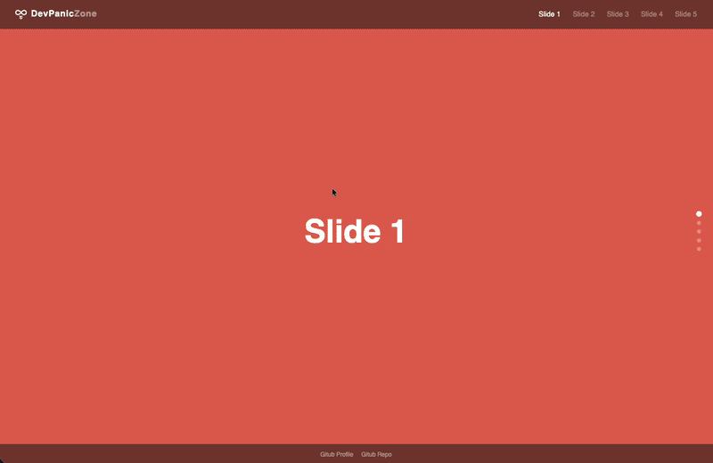

# Vertical Fullscreen Loop Scroll

*Supervised vibe coding - JavaScript AI-assisted, hand-rebuilt from scratch. A lot of "wait, why does that work?" moments.*

A lightweight, privacy-first fullscreen vertical loop scroller - built with vanilla HTML, CSS, and JavaScript. No frameworks, no CDN dependencies, no tracking.



[](https://dontdevpanic.github.io/vertical-fullscreen-loop-scroll/)

---

## About

This project was built as part of my learning journey into vanilla JavaScript.
No frameworks, no shortcuts - just a lot of questions, debugging, and "aha!" moments.
AI-assisted but hand-coded from scratch. 

---

## Features

- Endless seamless loop - scrolls infinitely in both directions
- Smooth scroll animation with easing (`easeInOutCubic`)
- Automatic slide duplication via `cloneNode()` - no manual copy-paste
- Color palette change on each loop cycle
- ScrollSpy - navbar links and dot navigation update in sync
- Mobile overlay navigation (hamburger menu)
- Magic Mouse / trackpad compatible (wheel event cooldown)
- WCAG AA accessible - semantic HTML, ARIA labels, keyboard navigation
- No cookies, no tracking, no external dependencies

---

## Usage

Clone or download the repo and open `index.html` in your browser - no build step required.

```bash
git clone https://github.com/dontdevpanic/vertical-fullscreen-loop-scroll.git
```

### Adding Slides

Add a new `div` (or `section`) inside `#track`:

```html
<div class="loop-slide" data-index="5">Slide 6</div>
```

Add a matching color in each palette in `main.js`:

```javascript
const palettes = [
    [
        { bg: "#e76f51", color: "#fff" },
        // ... existing slides ...
        { bg: "#yourcolor", color: "#fff" }, // ← new slide
    ],
    // repeat for other palettes
];
```

That's it - the JS counts slides automatically, duplicates them, and builds the dot navigation.

### Customizing Palettes

Edit the `palettes` array in `main.js`. Each palette is an array of `{ bg, color }` objects - one per slide, in order.

### Scroll Speed

Adjust the animation duration in `main.js`:

```javascript
const duration = 700; // milliseconds
```

---

## File Structure

```
vertical-fullscreen-loop-scroll/
├── index.html
├── style.css
├── main.js
└── loop-logo.svg
```

---

## How It Works

Slides are duplicated once via JavaScript (`cloneNode`). The scroll track contains 2× the number of slides. When the last slide is reached, the track silently resets to the original position - creating a seamless infinite loop.

Color palettes cycle on each loop reset via inline `style` on each slide.

---

## Browser Support

All modern browsers. No polyfills needed.

---

## License

MIT - free to use, modify, and share.

---

*Built by [DontDevPanic](https://github.com/dontdevpanic) - AI-inspired, hand-coded.*

---
---
---

# Vertical Fullscreen Loop Scroll

*Betreutes Vibe Coding - KI-unterstützt bei JavaScript, von Hand nachgebaut. Mit vielen "warte mal, warum funktioniert das eigentlich?"-Momenten.*


Ein schlankes, datenschutzfreundliches Fullscreen-Loop-Scroller-Template - gebaut mit vanilla HTML, CSS und JavaScript. Keine Frameworks, keine CDN-Abhängigkeiten, kein Tracking.


[](https://dontdevpanic.github.io/vertical-fullscreen-loop-scroll/)

---

## Über dieses Projekt

Entstanden als Teil meiner Lernreise in vanilla JavaScript.
Keine Frameworks, keine Abkürzungen - nur viele Fragen, Debugging und "Aha!"-Momente. KI-unterstützt, aber von Hand nachgebaut.

---

## Features

- Endloser nahtloser Loop - scrollt unendlich in beide Richtungen
- Sanfte Scroll-Animation mit Easing (`easeInOutCubic`)
- Automatische Slide-Duplizierung via `cloneNode()` - kein manuelles Kopieren
- Farbpaletten-Wechsel bei jedem Loop-Durchgang
- ScrollSpy - Navbar-Links und Dot-Navigation aktualisieren sich synchron
- Mobile Overlay-Navigation (Hamburger-Menü)
- Magic Mouse / Trackpad-kompatibel (Wheel-Event-Cooldown)
- WCAG AA barrierefrei - semantisches HTML, ARIA-Labels, Tastaturnavigation
- Keine Cookies, kein Tracking, keine externen Abhängigkeiten

---

## Verwendung

Repo klonen oder herunterladen und `index.html` im Browser öffnen - kein Build-Schritt erforderlich.

```bash
git clone https://github.com/dontdevpanic/vertical-fullscreen-loop-scroll.git
```

### Slides hinzufügen

Ein neues `div` (oder `section`) innerhalb von `#track` einfügen:

```html
<div class="loop-slide" data-index="5">Slide 6</div>
```

In jeder Palette in `main.js` eine passende Farbe ergänzen:

```javascript
const palettes = [
    [
        { bg: "#e76f51", color: "#fff" },
        // ... bestehende Slides ...
        { bg: "#deinefarbe", color: "#fff" }, // ← neuer Slide
    ],
    // für weitere Paletten wiederholen
];
```

Das war's - das JS zählt die Slides automatisch, dupliziert sie und baut die Dot-Navigation.

### Paletten anpassen

Das `palettes`-Array in `main.js` bearbeiten. Jede Palette ist ein Array aus `{ bg, color }`-Objekten - eines pro Slide, in Reihenfolge.

### Scroll-Geschwindigkeit

Die Animationsdauer in `main.js` anpassen:

```javascript
const duration = 700; // Millisekunden
```

---

## Dateistruktur

```
vertical-fullscreen-loop-scroll/
├── index.html
├── style.css
├── main.js
└── loop-logo.svg
```

---

## Funktionsweise

Slides werden einmalig per JavaScript (`cloneNode`) dupliziert. Der Scroll-Track enthält die doppelte Anzahl an Slides. Wenn der letzte Slide erreicht wird, springt der Track unsichtbar zurück zur Ausgangsposition - das erzeugt den nahtlosen Endlosloop.

Farbpaletten wechseln bei jedem Loop-Reset über inline `style` auf jedem Slide.

---

## Browser-Unterstützung

Alle modernen Browser. Keine Polyfills erforderlich.

---

## Lizenz

MIT - frei verwendbar, veränderbar und teilbar.

---

*Erstellt von [DontDevPanic](https://github.com/dontdevpanic) - KI-inspiriert, handgeschrieben.*